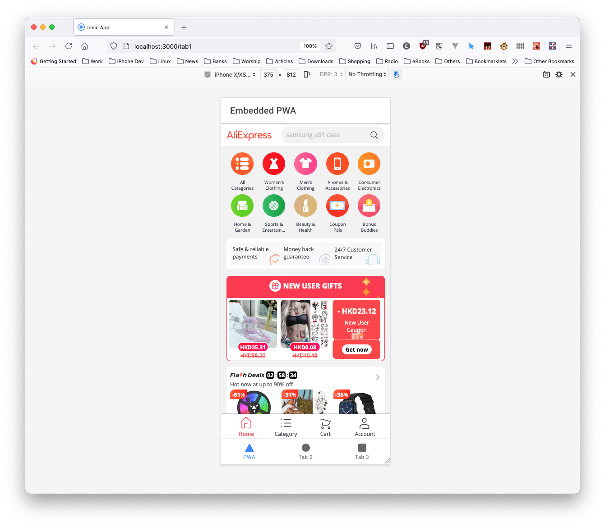
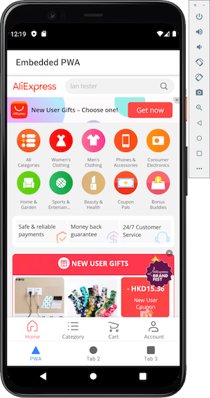

# Ionic Example App

This example demonstrate how to use [Ionic](https://ionicframework.com/) for mobile app development. The app is generated by the ionic command `ionic start PwaReactApp tabs --type=react`. It is a tabbed design and the first tab demonstrate how to embed an external PWA app (e.g. The [AliExpress PWA](https://m.aliexpress.com)).

## Requirement

1. [Node.JS 14](https://nodejs.org/en/)
1. [yarn](https://yarnpkg.com/getting-started/install)
1. [Ionic](https://ionicframework.com/)
1. [Android Studio](https://developer.android.com/studio) for Android app development
1. [Xcode](https://developer.apple.com/xcode/) and macOS machine (For iOS app development, optional)

## First time Setup

1. Check out this repository
1. `yarn`
1. `ionic cap add android`

## Run on Web Browser

1. `yarn start`
1. Open a web browser and go to the address `http://localhost:3000/`.

## Run on Android Device

1. `ionic cap build android`
1. Android Studio will be automatically launched. In Android Studio, choose `Run`->`Run 'app'`. Please note that **API 29** and **API 30** are tested OK. Other API versions are not tested.
